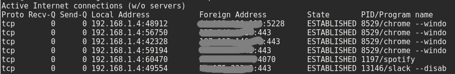

# Sysadmin
Useful commands and scripts for sysadmin basic tasks.

Optional line arguments are surronded by square brackets [], and example arguments are surrondend by <>.

---

### SSH
Configuration file `/etc/ssh/sshd_config`

* 'Port' - Default SSH port (Change)
* 'PermitRootLogin' - Root login allowed ways (Change from 'yes' to 'without-password' to only allow root connection with public key authentication)

---

### Firewall
Commands to list, add and remove rules on Iptables program.

```
$ iptables -S
$ iptables -nL --line-numbers
$ iptables -I <INPUT [line-number] -p tcp -m tcp --dport 80 -j ACCEPT>
$ iptables -D <INPUT -i lo -j ACCEPT>
```

To persist the Iptables modified rules, I use `iptables-persistent` utilitary. After change a rule, just exec `invoke-rc.d iptables-persistent save` to save modifications.

My common Iptables configuration:


---

### cURL
Command-line tool for transferring data using various protocols

#### Measuring request response time
- Create `curl-format.txt` file:
```
    time_namelookup:  %{time_namelookup}\n
       time_connect:  %{time_connect}\n
    time_appconnect:  %{time_appconnect}\n
   time_pretransfer:  %{time_pretransfer}\n
      time_redirect:  %{time_redirect}\n
 time_starttransfer:  %{time_starttransfer}\n
                    ----------\n
         time_total:  %{time_total}\n
```

- Make the request:
```
curl -w "@curl-format.txt" -o /dev/null -s "http://wordpress.com/"
```

#### SOAP requests
- Create `body_request` file:
```
<?xml version="1.0" encoding="UTF-8"?>
<soapenv:Envelope xmlns:soapenv="http://schemas.xmlsoap.org/soap/envelope/" xmlns:wse="NameSpace">
  <soapenv:Header/>
  <soapenv:Body>
    ...
  </soapenv:Body>
</soapenv:Envelope>
```

- Make the request:
```
$ curl -X POST -H "Content-Type: text/xml" -H "SOAPAction: MYSoapAction" --data-binary @body_request.xml https://my.server.com/Path
```
---

### Netstat
Print network connections

List tcp connections (t), without resolving ip addresses (n) and showing the process pid (p). To show the process pid (p) you may need to run as `root`.
```
$ netstat -tnp
```



* Useful tips:

Filter by port
```
$ netstat -tnp | grep :80
```

---

### Nmap
Network mapping. Scan hosts or IP address. Along with many purposes, `nmap` can be used to scan open ports in a remote host.

Scan a host or IP address. Use `-6` to scan an IPv6 address
```
$ nmap [-6] host_or_address
```

Scan multiple IP address or subnet (IPv4)
```
$ nmap 192.168.1.1 192.168.1.2 192.168.1.3
## works with same subnet i.e. 192.168.1.0/24
$ nmap 192.168.1.1,2,3
```
IPv6 could take years to scan a normal subnet /64. Use with caution.

Scan IPs from a file
```
$ nmap -iL /tmp/address_list.txt
```

Turn on OS detection
```
# IPv4
$ nmap -A 192.168.1.1
# IPv6
$ nmap -A -6 ::1
```

Scan a host for UDP services (UDP scan)
```
$ nmap -sU 192.168.1.1
```

---

### CPU and Mem usage of a process (ps)
Get process stats

```
$ ps -aux | grep <proc-name>
```

Column order:
```
USER PID %CPU %MEM VSZ RSS TTY STAT START TIME COMMAND
```

---

### Users and groups
Basic commands to handle user attributes (Passsword, groups, etc):

```
$ adduser <username>
$ adduser <username> <group>
$ useradd <username>
$ passwd <username>
$ deluser <username>
```

Auditing commands:
```
$ w
$ last
$ last -f /var/log/wtmp.1 (ls /var/log/wtmp*)
$ lastlog
```

List which user/process has opened a specific file

```
$ lsof /var/log/syslog
```

Run as `root` to show process owned by root.

---

### Services
Commands for listing system services:

```
$ service --status-all
$ initctl list
```

---

### Tools
Useful tools

* vim - Text editor
* htop - Interactive process viewer

---

## References and useful links
* [Initial Server Setup with Ubuntu 14.04](https://www.digitalocean.com/community/tutorials/initial-server-setup-with-ubuntu-14-04)
* [How To Set Up a Firewall Using Iptables on Ubuntu 14.04](https://www.digitalocean.com/community/tutorials/how-to-set-up-a-firewall-using-iptables-on-ubuntu-14-04)
* [Linux Create User Account](http://www.cyberciti.biz/faq/howto-add-new-linux-user-account/)
* [Top 30 Nmap Command Examples For Sys/Network Admins](http://www.cyberciti.biz/networking/nmap-command-examples-tutorials/)
* [7 Security Measures to Protect Your Servers](https://www.digitalocean.com/community/tutorials/7-security-measures-to-protect-your-servers)
