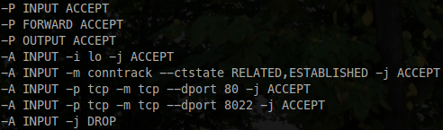

# Sysadmin
Useful commands and scripts for sysadmin basic tasks.

Optional line arguments are surronded by square brackets [], and example arguments are surrondend by <>.

## SSH
Configuration file `/etc/ssh/sshd_config`

* 'Port' - Default SSH port (Change)
* 'PermitRootLogin' - Root login allowed ways (Change from 'yes' to 'without-password' to only allow root connection with public key authentication)

## Firewall
Commands to list, add and remove rules on Iptables program.

```
$ iptables -S
$ iptables -nL --line-numbers
$ iptables -I input [line-number] <INPUT -p tcp -m tcp --dport 80 -j ACCEPT>
$ iptables -D <INPUT -i lo -j ACCEPT>
```

To persist the Iptables modified rules, I use `iptables-persistent` utilitary. After change a rule, just exec `invoke-rc.d iptables-persistent save` to save modifications.

My common Iptables configuration:



## Users and groups
Basic commands to handle user attributes (Passsword, groups, etc):

```
$ adduser <username>
$ adduser <username> <group>
$ useradd <username>
$ passwd <username>
$ deluser <username>
```

Auditing commands: 
```
$ w
$ last
$ lastlog
```

## Tools
Useful tools

* vim - Text editor
* htop - Interactive process viewer
